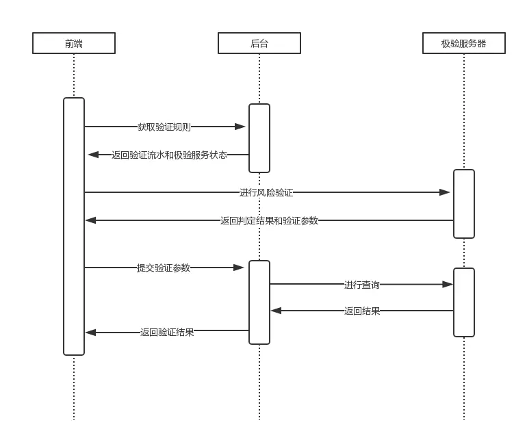

# 二、用户登录

## 功能介绍

- 登录[移动端](http://toutiao.research.itcast.cn/#/login)获取账号
- 点击获取验证码
- 人机交互验证：防止机器暴力发送验证码，疯狂发短信
  - 例如我写一个循环疯狂调用发送验证码接口，这是非常危险的操作，整个发送短信系统就没办法工作了
  - [极验](https://www.geetest.com/)
- 表单提交

## 页面布局

- 公共样式写到 `styles/index.less` 中并在 `main.js` 中引入全局生效
- 组件样式写到组件内部，建议都加上作用域
- 修改 Element 组件样式，可以手动为组件加一个 CSS `class` 类名，然后通过该选择器为其设置样式

## 发送验证码

> 注意：短信资源短缺，请大家在满足学习的情况下减少无用测试，谢谢配合。



1. 点击获取验证码，发送请求 `获取人机验证码（极验 API1）`，获取用来初始化验证码的参数
2. 调用极验的 [JavaScript SDK](https://raw.githubusercontent.com/GeeTeam/gt3-node-sdk/master/demo/static/libs/gt.js) 提供的 API，通过上一步得到的数据初始化验证码
3. 用户通过人机交互验证之后，极验会给你返回一些验证的结果数据，然后调用你的 `获取短信验证码 (极验 API2）` 接口，如果正确，短信就可以发出去了
4. 按钮倒计时效果

下面是具体实现步骤：

1. 点击获取验证码按钮，发送请求，获取用来初始化验证码的参数

```js
handleSendCode () {
  const { mobile } = this.form
  axios({
    method: 'GET',
    url: `http://ttapi.research.itcast.cn/mp/v1_0/captchas/${mobile}`
  }).then(res => {
    const { data } = res.data
  })
}
```

请求结果数据如下：

```json
{
  "message": "xxx",
  "data": {
    "success": "xxx",
    "gt": "xxx",
    "challenge": "xxx",
    "new_captcha": "xxx"
  }
}
```

2. 加载极验提供的 JavaScript SDK 到项目中（极验开发团队没有考虑 Web 开发者的使用体验，差评！）

- [极验 JavaScript SDK 文件地址](https://raw.githubusercontent.com/GeeTeam/gt3-node-sdk/master/demo/static/libs/gt.js)

将 `gt.js` 文件下载到项目的 `src/vendor` 目录中，然后在 `src/views/login/index.vue` 中加载该文件。

> 小提示：我们建议把没有提供 npm 包的第三方内容都放到项目的 `src/vendor` 目录中

```js
...
# gt.js 会提供一个全局函数 initGeetest
import '@/vendor/gt.js'
...
```

一个小插曲：当你在项目中引入 gt.js 模块之后你会发现在终端中输出很多（400+）语法格式错误，这是因为 ESLint 也把 gt.js 当作我们自己写的 JavaScript 文件去进行代码格式检查了。

极验虽然是一个第三方文件，但是该文件是我们手动下载到项目中（非 npm 模块）去加载使用的，所以 ESLint 也会检查该文件的代码规则，在这里是没有必要的，代码格式检查应该主要针对我们的代码文件，解决方法就是在项目的根目录创建一个文件 `.eslintignore`并写入以下内容：

```
src/vendor/gt.js
```

`.eslintignore` 文件类似于 `.gitignore`，它的作用是手动配置 ESLint 不需要校验的代码文件。

配置好以后，重启服务就好了。

3. 查看[极验文档](https://docs.geetest.com/install/deploy/client/web)，体验[官方 demo](https://docs.geetest.com/install/apirefer/api/web#product)
4. 根据文档中的说明，调用 `initGeetest` 函数初始化极验验证码

```js {8-28}
handleSendCode () {
  const { mobile } = this.form
  axios({
    method: 'GET',
    url: `http://ttapi.research.itcast.cn/mp/v1_0/captchas/${mobile}`
  }).then(res => {
    const { data } = res.data
    window.initGeetest({
      // 以下配置参数来自服务端 SDK
      gt: data.gt,
      challenge: data.challenge,
      offline: !data.success,
      new_captcha: data.new_captcha,
      product: 'bind' // 隐藏，直接弹出式
    }, (captchaObj) => {
      this.captchaObj = captchaObj
      captchaObj.onReady(function () {
        // 验证码ready之后才能调用verify方法显示验证码
        captchaObj.verify()
      }).onSuccess(function () {
        // 人机交互验证通过
        console.log(captchaObj.getValidate())
      }).onError(function () {
        // your code
      })
    })
  })
}
```

5. 在极验的 `onSuccess` 回调函数中，将调用 `captchaObj.getValidate()` 获取到的结果参数作为发送短信验证码接口的请求参数发出获取短信验证码请求

```js {20-38}
handleSendCode () {
  const { mobile } = this.form
  axios({
    method: 'GET',
    url: `http://ttapi.research.itcast.cn/mp/v1_0/captchas/${mobile}`
  }).then(res => {
    const { data } = res.data
    window.initGeetest({
      // 以下配置参数来自服务端 SDK
      gt: data.gt,
      challenge: data.challenge,
      offline: !data.success,
      new_captcha: data.new_captcha,
      product: 'bind' // 隐藏，直接弹出式
    }, (captchaObj) => {
      captchaObj.onReady(function () {
        // 验证码ready之后才能调用verify方法显示验证码
        captchaObj.verify()
      }).onSuccess(function () {
        // 人机交互验证通过
        const {
          geetest_challenge: challenge,
          geetest_seccode: seccode,
          geetest_validate: validate } =
              captchaObj.getValidate()

        axios({
          method: 'GET',
          url: `http://ttapi.research.itcast.cn/mp/v1_0/sms/codes/${mobile}`,
          params: {
            challenge,
            validate,
            seccode
          }
        }).then(res => {
          console.log(res.data)
          // 开启倒计时效果
        })
      }).onError(function () {
        // your code
      })
    })
  })
}
```

6. 不出意外的话，你应该可以收到短信验证码了。

## 提交登录

## 表单验证

参考文档：[Element - Form 表单 -> 表单验证](https://element.eleme.cn/#/zh-CN/component/form#form-biao-dan)

Form 组件提供了表单验证的功能，只需要通过 `rules` 属性传入约定的验证规则，并将 Form-Item 的 `prop` 属性设置为需校验的字段名即可。校验规则参见 [async-validator](https://github.com/yiminghe/async-validator)

下面是内置的基本验证规则：

| 规则     | 说明                                                                                                                                                                                                        |
| -------- | ----------------------------------------------------------------------------------------------------------------------------------------------------------------------------------------------------------- |
| required | 必须的                                                                                                                                                                                                      |
| pattern  | 正则表达式                                                                                                                                                                                                  |
| range    | 使用 min 和 max 属性定义范围。对于字符串和数组类型，将根据长度进行比较，对于数字类型，数字不得小于 min，也不得大于 max。                                                                                    |
| len      | 要验证字段的确切长度，请指定 len 属性。对于字符串和数组类型，对 length 属性执行比较，对于数字类型，此属性指示数字的完全匹配，即，它可能仅严格等于 len。如果 len 属性与最小和最大范围属性组合，则 len 优先。 |
| enum     | 要从可能值列表中验证值，请使用带枚举属性的枚举类型，列出该字段的有效值，例如：<br />var descriptor = { role: {type: "enum", enum: ['admin', 'user', 'guest']} }                                             |

如果内置的校验规则不满足，也可以自定义校验规则，参见：[Element - Form 表单 -> 自定义校验规则](https://element.eleme.cn/#/zh-CN/component/form#form-biao-dan)

## 总结

```html
<template>
  <div class="login-wrap">
    <div class="login-form-wrap">
      <div class="login-head">
        
      </div>
      <div class="login-form">
        <!--
          表单验证：
          rules 配置验证规则
          将需要验证的字段通过 prop 属性配置到 el-form-item 组件上
          ref   获取表单组件，可以手动调用表单组件的验证方法
         -->
        <el-form :model="form" :rules="rules" ref="ruleForm">
          <el-form-item prop="mobile">
            <el-input v-model="form.mobile" placeholder="手机号"></el-input>
          </el-form-item>
          <el-form-item prop="code">
            <el-input
              class="input-code"
              v-model="form.code"
              placeholder="验证码"
            ></el-input>
            <el-button
              class="btn-code"
              @click="handleSendCode"
              :disabled="!!codeTimer"
              >{{ codeTimer ? `剩余${countDown}秒` : '获取验证码' }}</el-button
            >
          </el-form-item>
          <el-form-item>
            <!-- 给组件加 class，会作用到它的根元素 -->
            <el-button
              class="btn-login"
              type="primary"
              @click="handleLogin"
              :loading="loginLoading"
              >登录</el-button
            >
          </el-form-item>
        </el-form>
      </div>
    </div>
  </div>
</template>

<script>
  import axios from "axios";
  import "@/vendor/gt"; // gt.js 会向全局 window 暴露一个函数 initGeetest

  export default {
    name: "AppLogin",
    data() {
      return {
        form: {
          // 表单数据
          mobile: window.localStorage.getItem("mobile") || "",
          code: ""
        },
        loginLoading: false, // 登录按钮的 loading 状态
        codeTimer: null,
        countDown: 10,
        rules: {
          // 表单验证规则
          mobile: [
            { required: true, message: "请输入手机号", trigger: "blur" },
            { len: 11, message: "长度必须为11个字符", trigger: "blur" }
          ],
          code: [
            { required: true, message: "请输入验证码", trigger: "blur" },
            { len: 6, message: "长度必须为6个字符", trigger: "blur" }
          ]
        },
        sendMobile: "",
        captchaObj: null // 通过 initGeetest 得到的极验验证码对象
      };
    },

    created() {
      // 检查本地存储的倒计时
      const codeTimer = window.localStorage.getItem("codeTimer");

      if (codeTimer) {
        const goneTime = Number.parseInt((+new Date() - codeTimer) / 1000);
        if (goneTime < 10) {
          this.countDown = 10 - goneTime;
          this.codeCountDown();
        } else {
          window.localStorage.removeItem("codeTimer");
        }
      }
    },

    methods: {
      handleLogin() {
        // 表单组件有一个方法 validate 可以用于获取当前表单的验证状态
        this.$refs["ruleForm"].validate(valid => {
          if (!valid) {
            return;
          }

          // 表单验证通过，提交登录
          this.submitLogin();
        });
      },

      submitLogin() {
        this.loginLoading = true;
        axios({
          method: "POST",
          url: "http://ttapi.research.itcast.cn/mp/v1_0/authorizations",
          data: this.form
        })
          .then(res => {
            // >= 200 && < 400 的状态码都会进入这里
            // Element 提供的 Message 消息提示组件，这也是组件调用的一种形式
            this.$message({
              message: "登录成功",
              type: "success"
            });

            this.loginLoading = false;

            // 建议路由跳转都使用 name 去跳转，路由传参非常方便
            this.$router.push({
              name: "home"
            });
          })
          .catch(err => {
            // >= 400 的 HTTP 状态码都会进入 catch 中
            if (err.response.status === 400) {
              this.$message.error("登录失败，手机号或验证码错误");
            }
            this.loginLoading = false;
          });
      },

      handleSendCode() {
        // 1. 校验手机号是否有效
        this.$refs["ruleForm"].validateField("mobile", errorMessage => {
          if (errorMessage) {
            return;
          }

          // 2. 手机号有效，初始化人机交互验证码
          this.showGeetest();
        });
      },

      codeCountDown() {
        this.codeTimer = setInterval(() => {
          this.countDown--;
          if (this.countDown <= 0) {
            window.clearInterval(this.codeTimer);
            this.codeTimer = null;
            this.countDown = 10;
            window.localStorage.removeItem("codeTimer");
          }
        }, 1000);
      },

      showGeetest() {
        if (this.captchaObj) {
          // 检查当前手机号和自上次初始化后的号码是否不一致
          if (this.form.mobile !== this.sendMobile) {
            // 如果不一致，则重新初始化
            // 将之前的验证码 DOM 删除
            document.body.removeChild(document.querySelector(".geetest_panel"));
            this.initGeetest();
          } else {
            // 如果一致，则直接显示之前的
            this.captchaObj.verify();
          }
        } else {
          this.initGeetest();
        }
      },

      initGeetest() {
        axios({
          method: "GET",
          url: `http://ttapi.research.itcast.cn/mp/v1_0/captchas/${this.form.mobile}`
        }).then(res => {
          const data = res.data.data;
          window.initGeetest(
            {
              // 以下配置参数来自服务端 SDK
              gt: data.gt,
              challenge: data.challenge,
              offline: !data.success,
              new_captcha: data.new_captcha,
              product: "bind" // 隐藏按钮式
            },
            captchaObj => {
              this.captchaObj = captchaObj;
              // 这里可以调用验证实例 captchaObj 的实例方法
              captchaObj
                .onReady(() => {
                  this.sendMobile = this.form.mobile;

                  // 只有 ready 了才能显示验证码
                  captchaObj.verify();
                })
                .onSuccess(this.sendCode);
            }
          );
        });
      },

      sendCode() {
        const {
          geetest_challenge: challenge,
          geetest_seccode: seccode,
          geetest_validate: validate
        } = this.captchaObj.getValidate();

        // 调用 获取短信验证码 (极验 API2）接口，发送短信
        axios({
          method: "GET",
          url: `http://ttapi.research.itcast.cn/mp/v1_0/sms/codes/${this.form.mobile}`,
          params: {
            // 专门用来传递 query 查询字符串参数
            challenge,
            seccode,
            validate
          }
        }).then(res => {
          // 交互成功，倒计时
          window.localStorage.setItem("codeTimer", +new Date());
          window.localStorage.setItem("mobile", this.form.mobile);
          this.codeCountDown();
        });
      }
    }
  };
</script>

<style lang="less" scoped>
  .login-wrap {
    height: 100%;
    display: flex;
    justify-content: center;
    align-items: center;
    background-color: #ccc;
    .login-form-wrap {
      background-color: #fff;
      padding: 50px;
      border-radius: 10px;
      width: 350px;
      .login-head {
        display: flex;
        justify-content: center;
        margin-bottom: 10px;
        img {
          width: 200px;
        }
      }
      .input-code {
        display: inline-block;
        width: 60%;
      }
      .btn-code {
        float: right;
      }
      .btn-login {
        width: 100%;
      }
    }
  }
</style>
```
