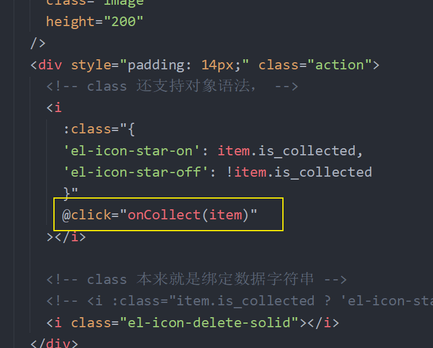
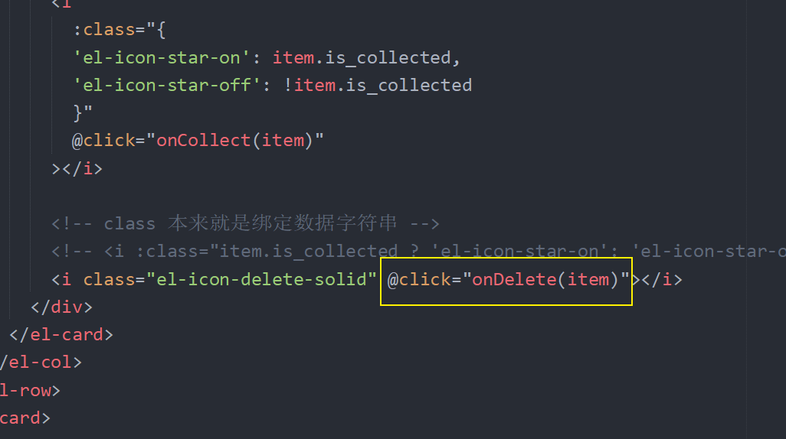
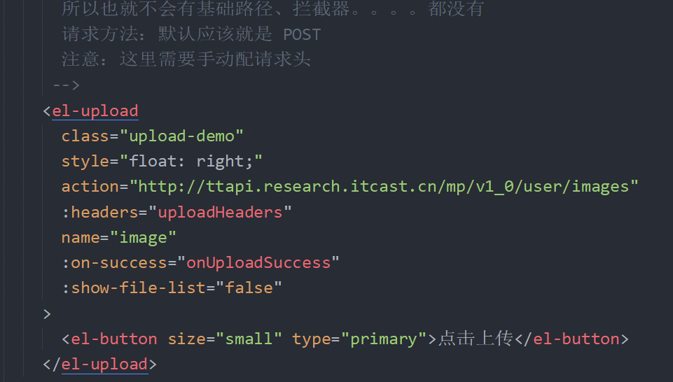
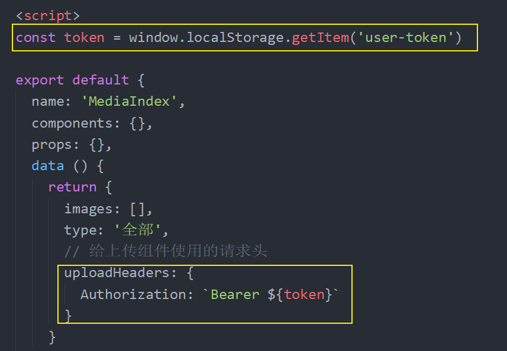
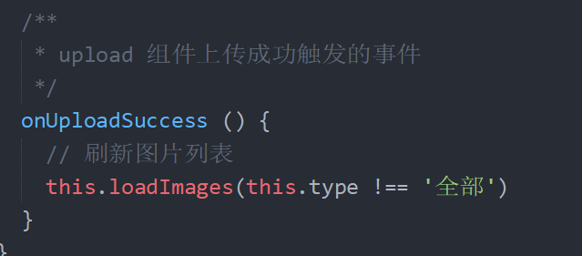
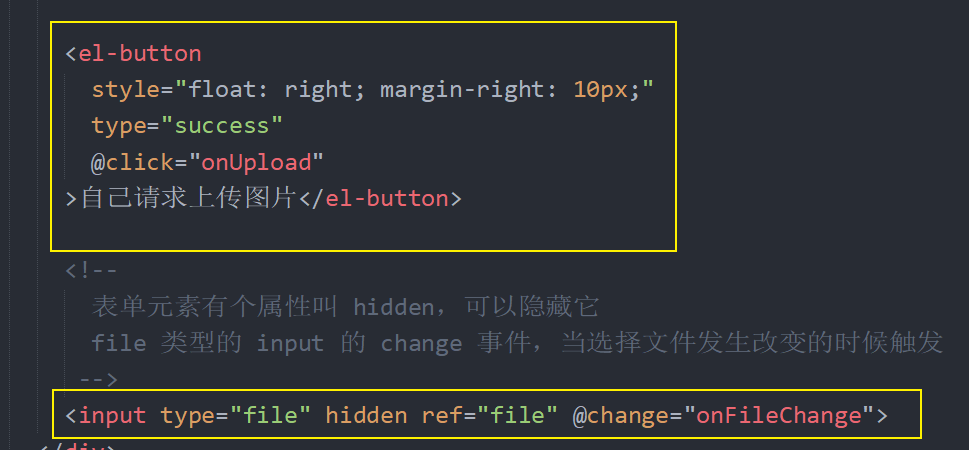
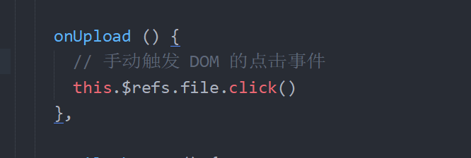

# 八、素材管理

## 创建组件并配置路由

1、创建组件

2、配置路由

3、配置侧边栏导航菜单

## 布局

## 展示素材列表

```html
<template>
  <div>
    <el-card class="box-card">
      <div slot="header" class="clearfix">
        <span>素材管理</span>
        <el-button style="float: right; padding: 3px 0" type="text"
          >上传图片</el-button
        >
      </div>
      <div>
        <el-radio-group v-model="type" @change="onFind">
          <el-radio-button label="全部">全部</el-radio-button>
          <el-radio-button label="收藏">收藏</el-radio-button>
        </el-radio-group>
      </div>
      <!--
        el-row 行
          gutter 间隔距离
        el-col 列
          span 用来指定列数
       -->
      <el-row :gutter="20">
        <el-col
          :xs="24"
          :sm="12"
          :md="4"
          v-for="item in images"
          :key="item.id"
          class="col-item"
        >
          <el-card :body-style="{ padding: '0px' }">
            
            <div style="padding: 14px;" class="action">
              <!-- class 还支持对象语法， -->
              <i
                :class="{
                'el-icon-star-on': item.is_collected,
                'el-icon-star-off': !item.is_collected
              }"
              ></i>

              <!-- class 本来就是绑定数据字符串 -->
              <!-- <i :class="item.is_collected ? 'el-icon-star-on': 'el-icon-star-off'"></i> -->
              <i class="el-icon-delete-solid"></i>
            </div>
          </el-card>
        </el-col>
      </el-row>
    </el-card>
  </div>
</template>

<script>
  export default {
    name: 'MediaIndex',
    components: {},
    props: {},
    data () {
      return {
  +      images: [],
  +      type: '全部'
      }
    },
    computed: {},
    watch: {},
    created () {
  +    this.loadImages()
    },
    methods: {
  +++    loadImages (isCollect = false) {
        this.$axios({
          method: 'GET',
          url: '/user/images',
          params: {
            collect: isCollect // 是否获取收藏图片
          }
        }).then(res => {
          this.images = res.data.data.results
        }).catch(err => {
          console.log(err)
        })
      },

      // 该函数是 radio 的 change 事件处理函数
      // 通过文档我们得知，事件函数有个回调参数：选中的 Radio label 值
      // 所以我们可以声明一个形参来接收使用
  +++    onFind (value) {
        this.loadImages(value !== '全部')
      }
    }
  }
</script>

<style lang="less" scoped>
  .grid-content {
    background-color: pink;
  }

  .col-item {
    margin-bottom: 20px;
    .action {
      display: flex;
      justify-content: space-around;
      font-size: 24px;
    }
  }
</style>
```

## 收藏/取消收藏图片

1、给收藏的图标按钮添加点击事件



2、在事件处理函数中

```js
/**
 * 收藏/取消收藏
 */
onCollect (item) {
  // 请求收藏/取消收藏
  this.$axios({
    method: 'PUT',
    url: `/user/images/${item.id}`,
    data: {
      collect: !item.is_collected
    }
  }).then(res => {
    this.$message({
      type: 'success',
      message: '操作成功'
    })

    // 更新视图展示
    item.is_collected = !item.is_collected
  }).catch(err => {
    console.log(err)
    this.$message.error('操作失败')
  })
}
```

## 删除图片

1、为删除按钮注册点击事件



2、处理函数

```js
/**
 * 删除图片
 */
onDelete (item) {
  this.$confirm('此操作将永久删除该文件, 是否继续?', '提示', {
    confirmButtonText: '确定',
    cancelButtonText: '取消',
    type: 'warning'
  }).then(() => {
    // 确定执行
    this.$axios({
      method: 'DELETE',
      url: `/user/images/${item.id}`
    }).then(res => {
      this.$message({
        type: 'success',
        message: '删除成功'
      })

      // 更新列表
      this.loadImages(this.type !== '全部')
    }).catch(err => {
      console.log(err)
      this.$message.error('删除失败')
    })
  }).catch(() => {
    // 取消执行
    this.$message({
      type: 'info',
      message: '已取消删除'
    })
  })
}
```

## 上传图片

1、在模板中使用上传组件



> action：请求地址
>
> headers：请求头，一个对象
>
> name：上传的数据字段名
>
> on-success：上传成功的回调
>
> show-file-list：是否显示上传的文件列表，默认是 true



3、在上传成功的回调中重新加载数据列表



## 扩展：自己手动上传图片

1、添加一个隐藏的 file 类型的 input 和一个按钮



2、当点击按钮的时候，手动触发 input 的点击事件



3、然后监听处理 input 的 `change` 事件

```js
onFileChange () {
  // 获取用户选择的那个文件对象
  const fileObj = this.$refs.file.files[0]

  // 创建一个表单数据对象
  const formData = new FormData()

  // 手动往表单数据中添加成员
  formData.append('image', fileObj)

  // 请求上传
  this.$axios({
    method: 'POST',
    url: '/user/images',
    // 我们常见的两种 Content-Type
    // application/json axios默认会设置
    // multipart/form-data 常用语文件上传
    // 错误的写法

    // 如果你提交的 data 是一个普通对象，axios 会自动把 Content-Type 设置为 application/json
    // data: {
    //   image: fileObj
    // }

    // 我们这里接口要求 Content-Type 为 multipart/form-data，所以需要使用 FormData 对象
    // 如果 data 提供的是一个 FormData ，那么 axios 会把  Content-Type 设置为 multipart/form-data
    data: formData
  }).then(res => {
    console.log(res)

    // 上传成功，更新数据列表
    this.loadImages(this.type !== '全部')
  }).catch(err => {
    console.log(err)
    this.$message.error('上传失败')
  })
}
```
