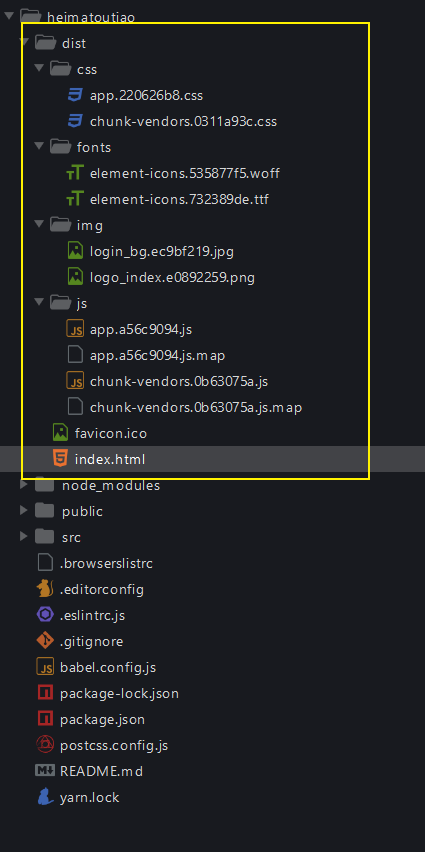
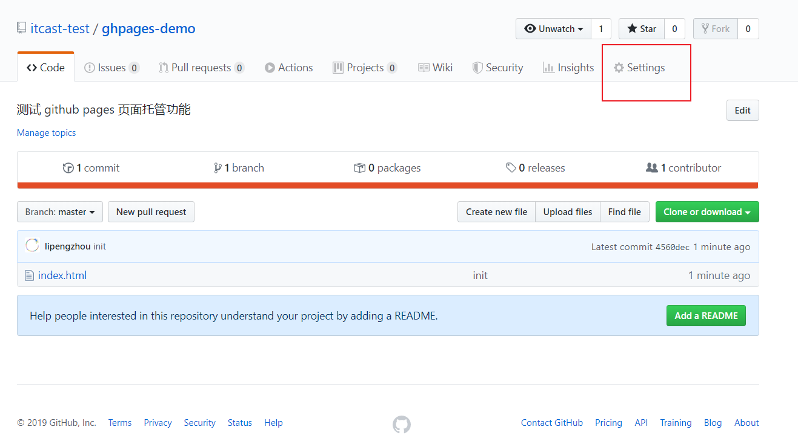
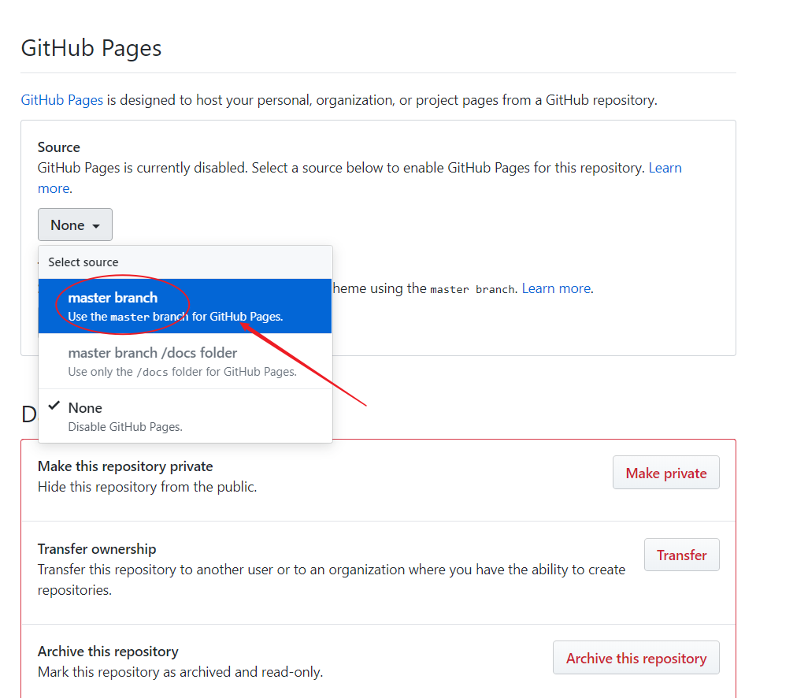
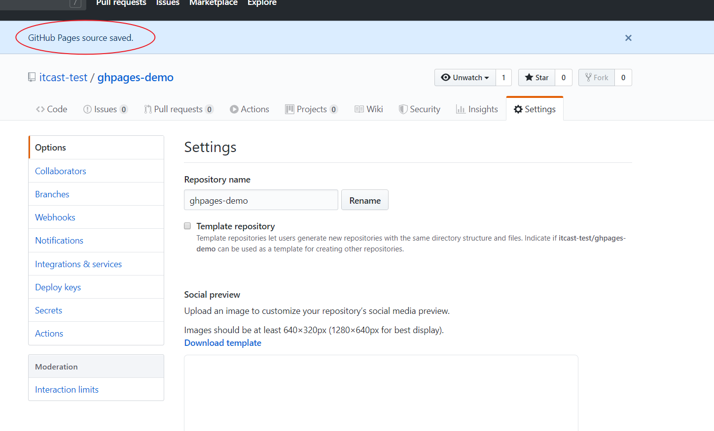
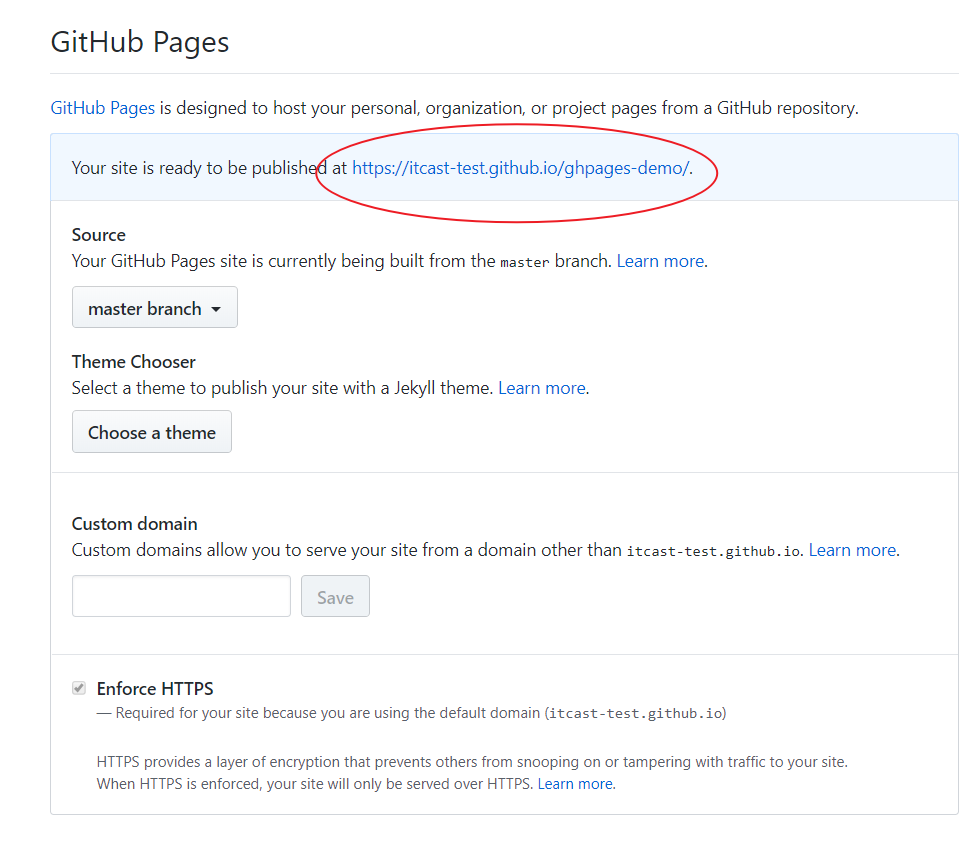

# 十一、打包发布

## 构建打包

在发布上线之前，我们需要执行构建打包，将 `.less`、`.vue`、`.js` 等相关资源进行编译打包，转换成浏览器可以直接识别运行的普通 `css`、`js`、`html`。

```bash
# yarn run build 或者 yarn build
npm run build
```

VueCLI 会把打包结果生成存储到项目的 `dist` 目录中。

正确的话应该会得到这样一个打包结果：



## 关于代码中的 console

console.log 只是用于开发测试使用，发布上线的话没有意义，所以 VueCLI 在打包构建的就是就给你报错不打包了。

正确的做法：

```
移除项目中所有的 console
```

为了给大家快速演示打包，我先手动把 console 校验关闭。

## 本地预览测试打包结果

> 注意：不能直接双击打开 index.html 运行。

将 dist 放到一个 Web 服务器中运行测试，常见的 Web 服务器：

- Ngxin
- Apache
- tomcat
- IIS
- 。。。。
- Node.js

前端安装配置上面的服务器软件麻烦，这里推荐使用 Vue 官方推荐的一个命令行 http 服务工具：[serve](https://github.com/zeit/serve)。

`dist` 目录需要启动一个 HTTP 服务器来访问 (除非你已经将 `publicPath` 配置为了一个相对的值)，所以以 `file://` 协议直接打开 `dist/index.html` 是不会工作的。在本地预览生产环境构建最简单的方式就是使用一个 Node.js 静态文件服务器，例如 [serve](https://github.com/zeit/serve)：

安装：

```bash
# yarn global add serve
# 注意：这是在安装全局包，在任何目录执行都可以
# 安装一次就可以了，以后不需要重复安装，顶多升级重装
npm install -g serve
```

然后在你的项目目录下执行：

```bash
# dist 是运行 Web 服务根目录
serve -s dist
```

如果启动成功，你将看到如下提示：

```
   ┌────────────────────────────────────────────────────┐
   │                                                    │
   │   Serving!                                         │
   │                                                    │
   │   - Local:            http://localhost:5000        │
   │   - On Your Network:  http://192.168.156.90:5000   │
   │                                                    │
   │   Copied local address to clipboard!               │
   │                                                    │
   └────────────────────────────────────────────────────┘
```

> serve 默认占用 5000 端口并启动一个服务

然后在浏览器中访问给出的地址访问测试。

你自己先大概的测试一下，确保打包结果可以正常运行，然后交由专业的测试人员进行测试。

如果测试出问题怎么办？

- 修改 src 源代码
- 重新构建打包

> 注意：
>
> 不要去修改 dist 中的文件代码，没有用。
>
> 因为每次 `npm run build` 都会先把原来的 dist 删除，然后生成新的结果。

## 部署

- 公司有专门的 devops，说白了就是运维
  - 有些公司没有专门的运维人员，那就后端负责
- 你只需要把打包结果给人家就可以了

```js
购买一个能24小时不关机的电脑（有了）
	安装配置服务器软件
  把你的项目打包结构扔到服务器的 Web 服务软件中
  阿里云（推荐）、腾讯云、百度云、
购买域名（非必须，也可以直接使用ip地址，只不过不好记）
```

## 扩展：GitHub Pages

GitHub 也提供了静态文件服务的功能，所谓的静态文件服务仅仅针对纯粹的 html、css、js 等文件托管。

它不能部署后端服务，例如 Java、Node.js、PHP 等都不行。

有了它，我们就能免费薅羊毛。我们能使用它部署自己的博客、学习测试的网站等都可以玩儿了 。

### 把静态文件推到 github 仓库

### 开启 GitHub Pages 服务





> 将 source 设置为你的 HTML 文件所在的分支



> 提示成功，往下滚动，找到给出的访问地址



> 访问图示中给出的地址

### 关于域名

#### 默认域名

GitHub 支持两种域名方式：

- 一种是：`你的用户id.github.io`

  - 只能有一个

- 一种是：`你的用户id.github.io/xxx`
  - 可以有任意个

对于第一种，你必须创建一个名字叫 `你的用户id.github.io` 的仓库，那么该仓库启用 GitHub Pages 之后默认域名就是：`你的用户id.github.io`。

对于第二种，仓库名字就无所谓了，托管到 GitHub Pages 的域名都是 `你的用户id.github.io/仓库名称`。

#### 自定义域名

GitHub 同时也支持自定义域名，前提是你得有一个个域名，推荐从以下渠道购买：

- [阿里云 - 万网](https://wanwang.aliyun.com/)
- [GoDaddy](https://www.godaddy.com/)
- [新网](http://www.xinnet.com/)
- ...

接下来推荐阅读：[三步搞定 Github Pages 自定义域名](https://www.jianshu.com/p/2647e079741f)。

## 将我们的项目部署到 GitHub Pages

如果打算将项目部署到 `https://.github.io/` 上, `publicPath` 将默认被设为 `"/"`，你可以忽略这个参数。

如果打算将项目部署到 `https://.github.io//` 上 (即仓库地址为 `https://github.com//`)，可将 `publicPath` 设为 `"//"`。举个例子，如果仓库名字为“my-project”，那么 `vue.config.js` 的内容应如下所示：

```js
module.exports = {
  publicPath: process.env.NODE_ENV === "production" ? "/my-project/" : "/"
};
```

修改完配置文件只有，要重新构建，然后将新的打包结果推到仓库才能生效。

推送的时候，为了方便，建议直接加上 `--force` 参数，强制推送。

```bash
# --force 强制推送，简写 -f
git push -u origin master -f
```
